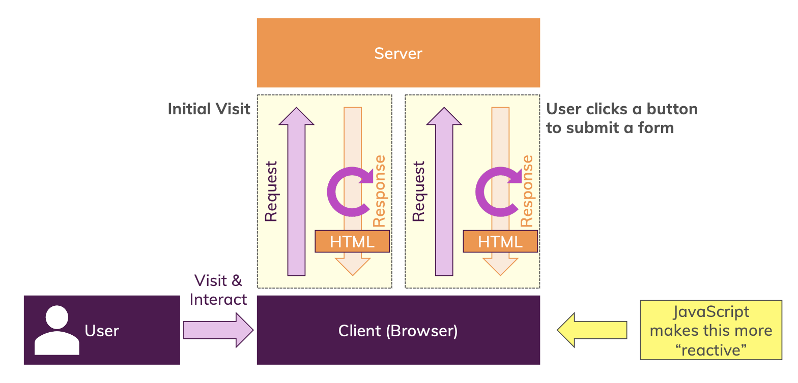
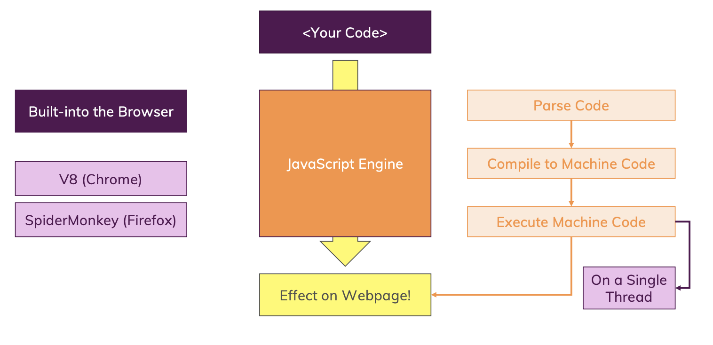

#### What is JavaScript?

> JavaScript is a dynamic, weakly typed programming language which is compiled at runtime. It can be executed as part of a webpage in a browser or directly on any machine (“host environment”).
> -> 런타임에 컴파일 되는 동적 프로그래밍 언어이다. 브라우저에서 웹페이지의 일부로 실행되거나, 직접 어떤 기기(“호스트 환경”)에서 실행될 수도 있다.

> JavaScript was created to make webpages more dynamic (e.g. change content on a page directly from inside the browser). Originally, it was called LiveScript but due to the popularity of Java, it was renamed to JavaScript.
> -> 웹페이지를 더 동적으로 만들기 위해 개발, ex)브라우저에서 직접 페이지의 내용을 변경하기 위해,,,

---

#### How do webpages work?

- 유저가 브라우저 사용
- 웹페이지 요청이 서버로 전송
- 서버가 그 웹페이지를 로드해 유저 브라우저로 다시 보냄
- 양식 제출을 서버로 보내기 위해 브라우저에서 서버로 새로운 요청 보내
- 주문 데이터를 저장하는 등 처리
- 완료 새로운 웹페이지 클라이언트에 응답 보냄

#### How is JavaScript executed?

- 크롬브라우저 v8엔진이야 역할: 코드를 분석
- 코드 분석
- 머신 코드로 즉석 컴파일링
- 머신 코드 실행

-- 브라우저에는 코드를 가져와서 컴파일하고 최적화하고 실행하는 내장 도구가 있고 모든 작업은 싱글스레드
